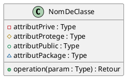
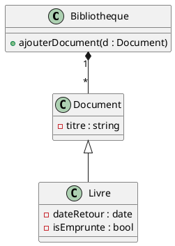

# PlantUML – Récapitulatif pour modéliser un diagramme de classe

Ce document résume la **syntaxe PlantUML** pour créer des **diagrammes de classes UML** clairs et fonctionnels.

---

## 🔨 Démarrage de base



---

## 📁 Déclaration d’une classe

```plantuml
class Nom {
  - nomAttribut : Type
  + nomMethode(param : Type) : TypeRetour
}
```

### Modifier le style d’une classe
```plantuml
abstract class Volume
interface Payable
enum Genre
```

---

## 🔗 Relations entre classes

### 1. **Héritage** (Généralisation)
```plantuml
ClasseFille --|> ClasseMere
```
Triangle vide, flèche vers la classe parent.

---

### 2. **Association**
```plantuml
Client --> Commande
```
Flèche pleine ou sans flèche (si bidirectionnelle).

### 3. **Composition** (forte, losange plein)
```plantuml
Maison *-- Piece
```
Pièce n’existe que dans la Maison.

### 4. **Agrégation** (faible, losange vide)
```plantuml
Equipe o-- Joueur
```
Joueur peut exister indépendamment de l’équipe.

### 5. **Dépendance** (utilisation ponctuelle)
```plantuml
Service ..> Logger
```
Flèche en pointillé : la classe utilise une autre (dans une méthode par exemple).

---

## 🔄 Multiplicité

La multiplicité s’ajoute **entre guillemets** près des extrémités de la relation :

```plantuml
Adherent "1" o-- "0..3" Livre
```

| Notation | Signification                  |
|----------|-------------------------------|
| `1`      | un et un seul                 |
| `0..1`   | optionnel                     |
| `*`      | zéro ou plusieurs             |
| `1..*`   | au moins un                   |
| `0..*`   | zéro, un ou plusieurs         |

---

## 🔍 Navigabilité

- Pour une flèche orientée : `A --> B`
- Pour une flèche bidirectionnelle : `A -- B`

> Remarque : la flèche indique qui "connait" qui (comme en programmation orientée objet).

---
Situation	Modélisation UML
Chemin ou nom de fichier	string
Fichier stocké (contenu binaire)	File ou byte[]
Métadonnées sur le fichier	class Fichier + association
Gestion avancée du fichier (upload)	classe métier dédiée

## 📒 Autres options utiles

### Afficher le titre du diagramme
```plantuml
@startuml
!title Diagramme de classe – Bibliothèque
```

### Regrouper les classes dans des packages
```plantuml
package "Module Principal" {
  class Classe1
  class Classe2
}
```

---

## 🎨 Exemple synthétique



---

Tu veux aussi un récapitulatif pour modéliser un diagramme **de séquence** en PlantUML ?

